:warning: WORK IN PROGRESS
==========================

# SikuliX IDE - Social UI Bot - NO API !!!

[](https://x.com/Damien_Fremont)
[](https://opensource.org/licenses/MIT)

2024's social networks bot. Does NOT use APIs but OS UI instead. Works on TW/X, FB, Instagram using Sikulix-IDE and web-browser UI (Firefox).


## Content

  - [Dependencies](#dependencies)
  - [Screenshots](#screenshots)
  - [Features](#features)
  - [Install](#install)
  - [Usage](#usage)
  - [Resources](#resources)

---------------------------------------

## Dependencies

- Java 8+
- FireFox + Container
- [SikuliX IDE v2.0.5](http://sikulix.com/)

## Screenshots

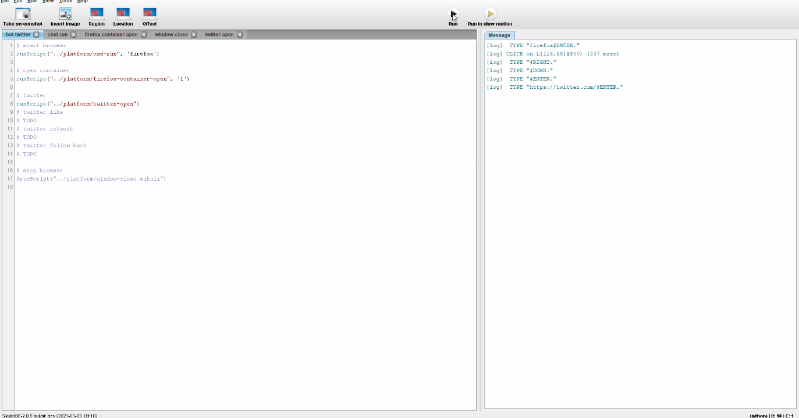

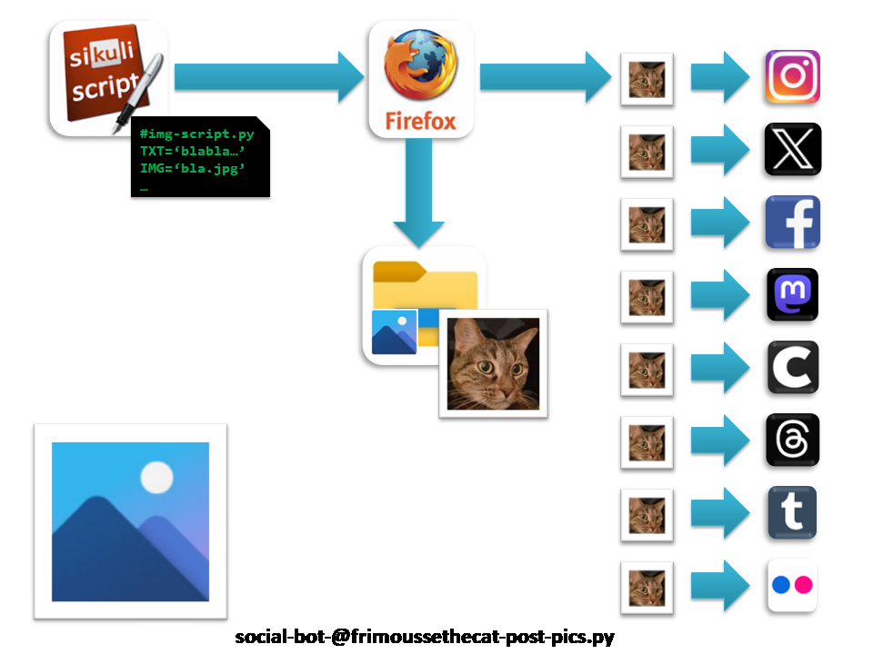

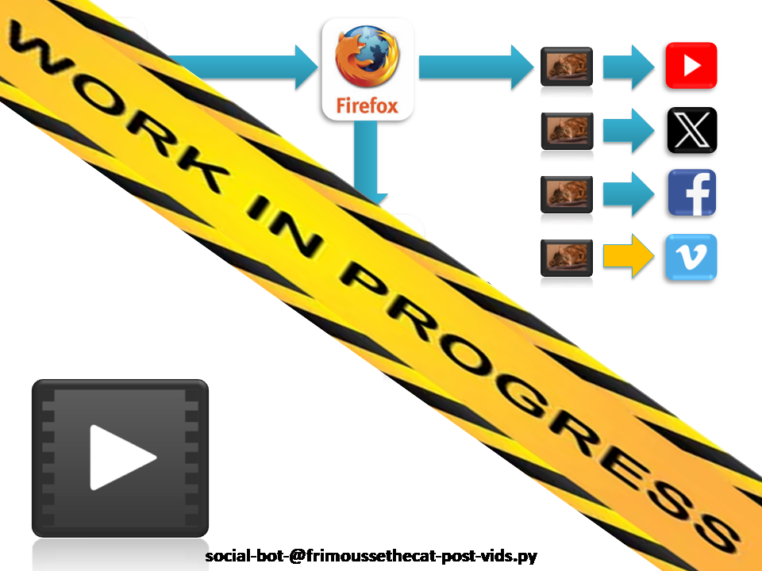

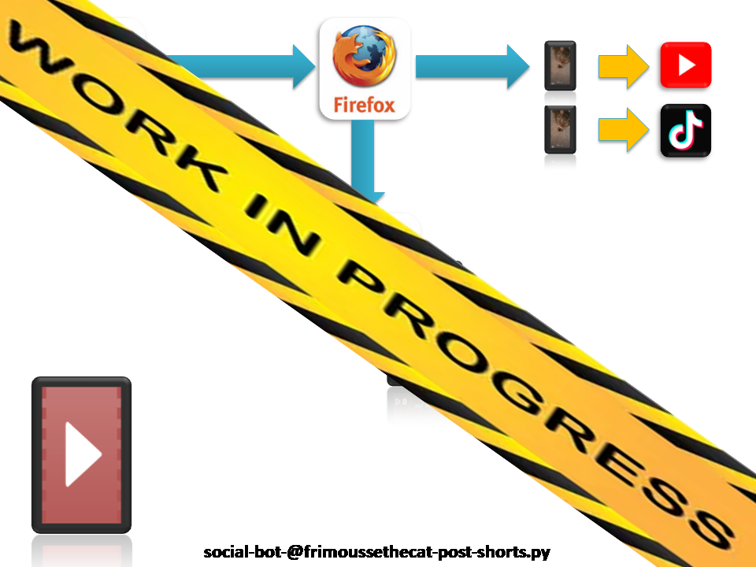

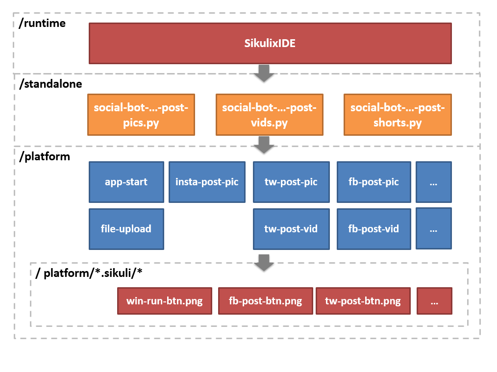

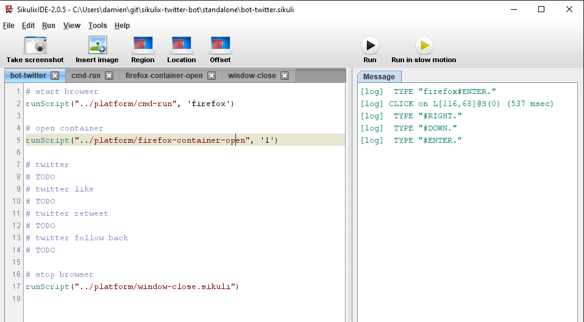

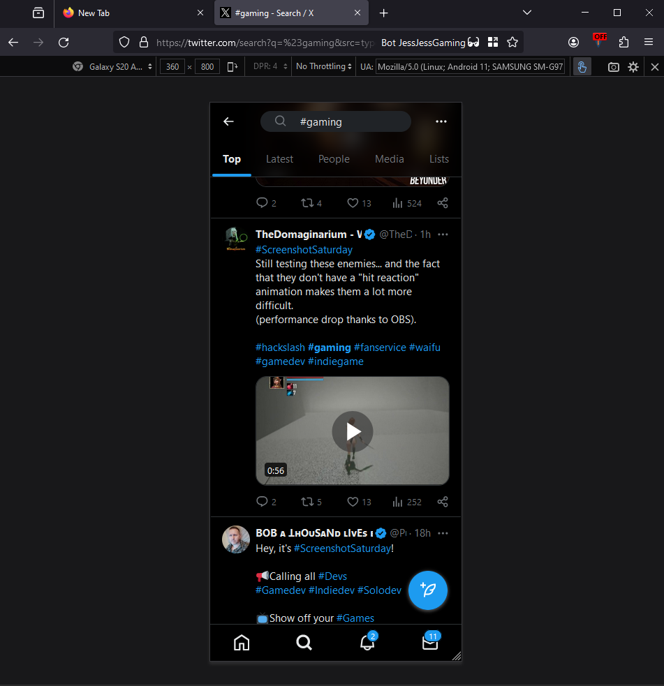

## Features

- Targets:
  - [x] Win64 (Windows 10)
- Social Platforms:
  - [x] Instagram: post pic
  - [x] Twitter: post pic, post vid, fav, rt, follow
  - [x] Facebook: post pic, post vid
  - [x] Mastodon: post pic
  - [x] Cara: post pic
  - [x] Threads: post pic
  - [x] Tumblr: post pic
  - [x] Flickr: post pic
  - [x] Youtube: post vid, post short
  - [ ] TikTok: post short
  - [ ] Vimeo: post vid
- Firefox Browser
  - [x] display: mobile view (resolution, zoom fixed)
  - [x] file: upload, copy image
  - [x] container: open

Repository layout:
```
├── docs
├── platform
│   └── firefox...
│   └── twitter...
├── standalone
│   ├── twitter-bot
└── tools
    └── ci
```

## Install

### Windows

Java:
- use your existing Java version 
- ...or follow SikuliX official [quickstart](http://sikulix.com/quickstart/)

FireFox + Container:
- download app [FireFox](https://www.mozilla.org/en-US/firefox/download/thanks/)
- install extension [Firefox Multi-Account Containers](https://addons.mozilla.org/en-US/firefox/addon/multi-account-containers/)
- open a tab with a container (ex: `Work`)

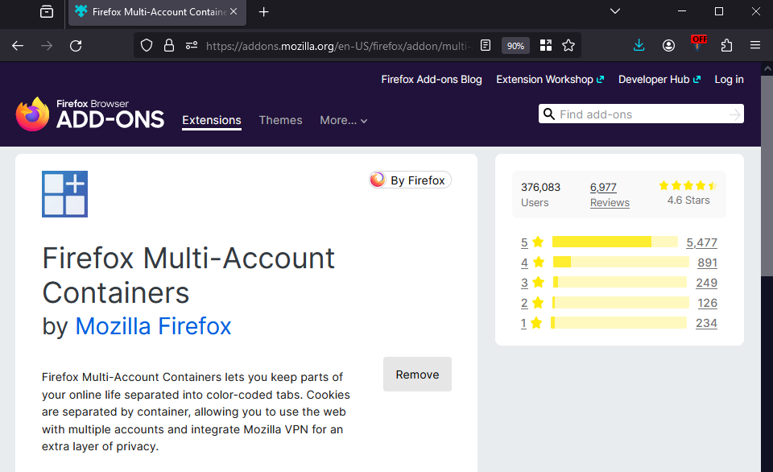

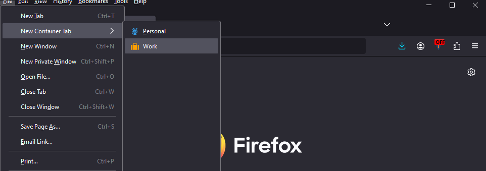

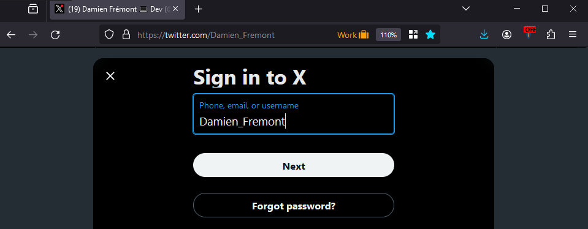

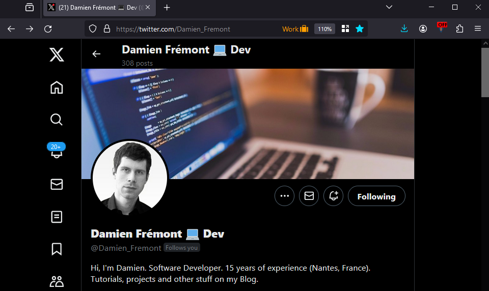

SikuliX IDE:
- Download the `v2.0.5` release of `SikuliX IDE` at https://launchpad.net/sikuli/sikulix/2.0.5/+download/sikulixide-2.0.5.jar.

## Usage

### CLI

TODO

### SikuliX IDE

- Start `SikuliX IDE`
- Run (SikuliX):
  - Menu > "File" > "Open" > `C:/...git/sikulix-twitter-bot/plateform/bot-twitter`
  - click "Run"


- Stop a running script with: <kbd>Alt</kbd> + <kbd>Shift</kbd> + <kbd>C</kbd>

## Resources

- Sikulix
  - [SikuliX](http://sikulix.com/)
  - [Keys](https://sikulix-2014.readthedocs.io/en/latest/keys.html)
  - [Running Scripts](https://sikulix.github.io/docs/scripts/running-scripts/)
